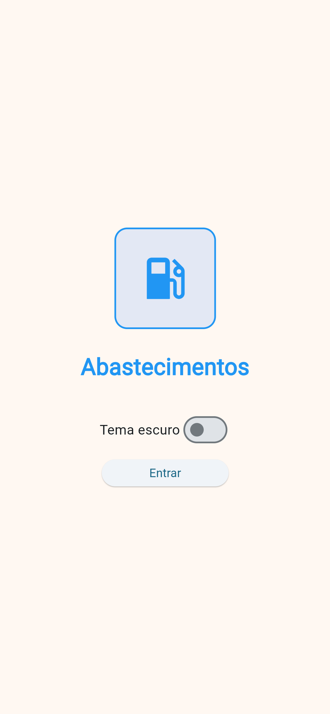
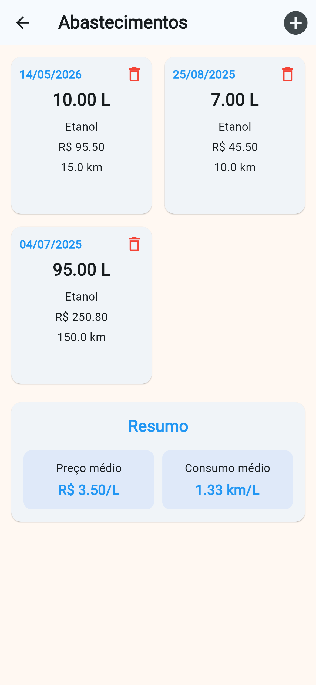
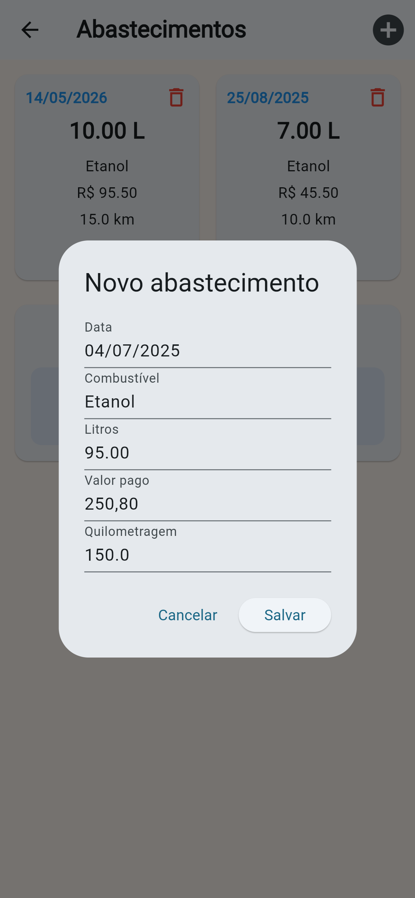

# App de Abastecimentos

## Descrição do projeto

Este projeto é um aplicativo mobile desenvolvido em Dart utilizando o Flutter para registrar e acompanhar um histórico de abastecimentos de veículos.

O aplicativo permite:

- Cadastrar abastecimentos
- Visualizar os registros em cards
- Excluir abastecimentos
- Editar os dados de um abastecimento
- Armazenar os registros localmente no celular
- Calcular o preço médio por litro
- Calcular o consumo médio do veículo em km/L

Cada abastecimento possui:

- Data
- Tipo de combustível
- Quantidade de litros
- Valor pago
- Quilometragem do veículo

O preço médio por litro é calculado considerando o valor total pago e a quantidade total de litros abastecidos.

O consumo médio do veículo é calculado considerando a distância percorrida entre o abastecimento atual e o anterior, dividida pela quantidade de litros abastecida.

O aplicativo também possui uma tela Splash com opção de alterar para o tema escuro.

O objetivo do app é praticar armazenamento local, cálculos, formulários, manipulação de listas e construção de interfaces com Flutter.

##  Prints das telas

As imagens do aplicativo estão disponíveis na pasta `assets/`.

| Tela | Descrição | Imagem |
|------|-----------|--------|
| Splash | Tela inicial do aplicativo |  |
| Home | Lista de abastecimentos cadastrados |  |
| Cadastro | Modal para adicionar ou editar um abastecimento |  |

---

##  Tecnologias utilizadas

- Dart
- Flutter
- Shared Preferences

---
##  Como executar o projeto

### 1. Instalar o Flutter

Siga a documentação oficial:
https://docs.flutter.dev/get-started/install

---

### 2. Clonar o repositório

```bash
git clone https://github.com/seu-usuario/seu-repositorio.git
```

---
```bash
cd nome-do-projeto
```

---

### 4. Instalar as dependências

```bash
flutter pub get
```

---

### 5. Executar o app

```bash
flutter run
```

---

##  Autora

Giovana Corrêa